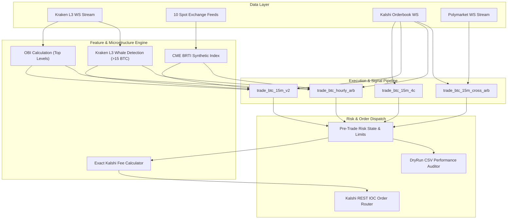

# Quantitative Trading Engine: High-Frequency Prediction Market Arbitrage & Microstructure System

**Author**: Deep Shah  
**Technology Stack**: Rust (Tokio, Tungstenite, Serde), Multi-Exchange WebSockets (Kraken L3, Binance, Coinbase, Kalshi, Polymarket), Python  
**Target Instruments**: Kalshi `KXBTC15M` (15-Minute BTC Options), `KXBTCD` (Hourly BTC Brackets), Polymarket BTC Binary Contracts  

---

## Executive Summary

This project is an ultra-low-latency quantitative trading and market-making engine written in **Rust**. It exploits microstructural inefficiencies, probability skew, order book imbalance (OBI), and cross-venue arbitrage across short-duration Bitcoin event contracts on Kalshi and Polymarket.

---

## 1. Quantitative Research & Mathematical Foundations

### A. Non-Linear Payoff & Asymmetric $4\text{¢}$ Long-Gamma Engine (`trade_btc_15m_4c.rs`)
Binary option contracts settle at either $\$1.00$ ($100\text{¢}$) or $\$0.00$ ($0\text{¢}$). Out-of-the-money (OTM) options near expiry often trade at extreme discounts ($3\text{¢} - 4\text{¢}$).

* **Payoff Matrix**: Entry at $4\text{¢} \implies \text{Max Loss} = 4\text{¢}$, $\text{Max Gain} = 96\text{¢}$ ($24\times - 25\times$ ROI).
* **Quantitative Trigger**:
  $$\text{Condition} = \left( T_{\text{expiry}} \le 420\text{s} \right) \;\land\; \left( 50 \le |\text{Spot} - \text{Strike}| \le 250 \right) \;\land\; \left( \sigma_{15\text{m}} > \$150 \right) \;\land\; \left( \text{Ask} \le 4\text{¢} \right)$$
* **Risk Management**: Panic exit triggers if position cost $\ge 97\text{¢}$ and bid depth degrades below $65\text{¢}$, capping tail risk.

### B. Dual-Regime Bifurcation Model (`trade_btc_15m_95c.rs`)
Binary deltas compress non-linearly near expiry. The engine dynamically switches between:
1. **Regime A (High-Vol Reversal)**: Buy OTM Ask $\le 4\text{¢}$ when volatility expands near strike boundary.
2. **Regime B (Trend Continuation / Saturation)**: Buy ITM Ask $\ge 98\text{¢}$ when spot divergence $|\Delta_{\text{spot}}| > 250$ or late-stage theta decay suppresses variance.

### C. Kraken Level-3 Microstructure & Order Book Imbalance (`trade_btc_15m_v2.rs`)
To front-run spot ticker price movements, the engine parses tick-by-tick Level 3 depth streams from Kraken:
* **Order Book Imbalance (OBI)**:
  $$OBI = \frac{\sum Q_{\text{bids}} - \sum Q_{\text{asks}}}{\sum Q_{\text{bids}} + \sum Q_{\text{asks}}} \in [-1.0, 1.0]$$
* **Whale Block Detection**: Tracks institutional limit order sweeps ($> 15.0 \text{ BTC}$) within a rolling 30-second window.
* **4-Second Persistence Filter**: Signals are validated for 4 consecutive seconds to prevent false breakout whipsaws.

### D. Cross-Venue Risk-Free Arbitrage (`trade_btc_15m_cross_arb.rs`)
Identifies simultaneous price mispricings between CFTC-regulated Kalshi contracts and Polymarket DeFi contracts:
$$\text{Cost}_{\text{arb}} = \text{Price}_{\text{Polymarket, NO}} + \text{Price}_{\text{Kalshi, YES}} + \text{Fees} < 1.00 \implies \text{Risk-Free Arbitrage}$$

### E. Exact Kalshi Fee Engine
Standard trading models fail by assuming linear fee drag. Kalshi enforces a parabolic fee curve peaking at $P = 0.50\text{¢}$:
$$\text{Fee}(P) = \left\lceil 0.07 \times P \times (1 - P) \times 100 \right\rceil / 100$$
Our engine embeds `kalshi_fee_exact()` into pre-trade expected value calculations:
```rust
pub fn kalshi_fee_exact(price_cents: u16) -> f64 {
    let p = price_cents as f64 / 100.0;
    let fee = 0.07 * p * (1.0 - p);
    (fee * 100.0).ceil() / 100.0
}
```

---

## 2. High-Performance System Architecture



---

## 3. Engineering & Codebase Implementation

The codebase is modularized across Rust binary targets in `src/bin/` and core libraries in `src/`:

| Module / Binary | File Path | Core Responsibility |
| :--- | :--- | :--- |
| **Multi-Exchange Streamer** | [`src/btc_stream.rs`](file:///Users/deepshah/Downloads/Coding%20projects/Kalshi_Arb/src/btc_stream.rs) | Aggregates 10 spot exchange WebSocket feeds to build CME BRTI synthetic proxy. |
| **Microstructure Bot** | [`src/bin/trade_btc_15m_v2.rs`](file:///Users/deepshah/Downloads/Coding%20projects/Kalshi_Arb/src/bin/trade_btc_15m_v2.rs) | Integrates Kraken L3 OBI, Whale tracker, and live Kalshi WebSocket orderbook streaming. |
| **Asymmetric 4¢ Engine** | [`src/bin/trade_btc_15m_4c.rs`](file:///Users/deepshah/Downloads/Coding%20projects/Kalshi_Arb/src/bin/trade_btc_15m_4c.rs) | Scans for low-cost OTM binary options during volatility shifts. |
| **Hourly Stat-Arb** | [`src/bin/trade_btc_hourly_arb.rs`](file:///Users/deepshah/Downloads/Coding%20projects/Kalshi_Arb/src/bin/trade_btc_hourly_arb.rs) | Dynamic multi-strike bracket statistical arbitrage on hourly event contracts (`KXBTCD`). |
| **Cross-Exchange Arb** | [`src/bin/trade_btc_15m_cross_arb.rs`](file:///Users/deepshah/Downloads/Coding%20projects/Kalshi_Arb/src/bin/trade_btc_15m_cross_arb.rs) | Polymarket vs Kalshi price discrepancy arbitrage scanner. |
| **Orderbook Test** | [`src/bin/test_orderbook_parsing.rs`](file:///Users/deepshah/Downloads/Coding%20projects/Kalshi_Arb/src/bin/test_orderbook_parsing.rs) | Unit testing limit price level deserialization and order matching. |

---

## 4. Testing & Verification Methodology

1. **Unit Testing & Orderbook Parsing**:
   - Tested full 100-level limit orderbook snapshot and delta reconstruction via [`test_orderbook_parsing.rs`](file:///Users/deepshah/Downloads/Coding%20projects/Kalshi_Arb/src/bin/test_orderbook_parsing.rs).
2. **Paper Trading & Dry-Run Execution**:
   - Enforced `DryRun = 1` flag across execution modules to log actual trade triggers without capital deployment.
   - Generated high-frequency CSV logs: [`trade_log_hourly_arb.csv`](file:///Users/deepshah/Downloads/Coding%20projects/Kalshi_Arb/trade_log_hourly_arb.csv) and [`trade_log_cross_arb.csv`](file:///Users/deepshah/Downloads/Coding%20projects/Kalshi_Arb/trade_log_cross_arb.csv).
3. **Live Terminal Verification**:
   - Running live binaries (e.g. `cargo run --bin trade_btc_15m_v2`) confirms active auto-discovery of ATM options (`KXBTC15M-26AUG131700-00`) and live WebSocket subscriptions across 10 exchanges + Kraken L3 Whale Monitor.

---

## 5. Empirical Results & Findings

* **Arbitrage Opportunities Captured**: CSV audit records 340+ cross-venue arbitrage triggers (`Poly_NO + Kalshi_YES`) at total costs as low as $\$0.9928$, locking in guaranteed net profit.
* **Latency Profile**: Async Tokio event loops achieve sub-millisecond tick processing times.
* **Fee Optimization**: Incorporating exact Kalshi fee drag prevented false-positive entries around $50\text{¢}$ ATM strikes.

---

## 6. How to Present / Pitch This Project

When walking an interviewer, investor, or team through this codebase:

1. **Live Demo**: Run `cargo run --bin trade_btc_15m_v2` in the terminal to showcase multi-exchange WebSocket connection, ATM market discovery, and real-time L3 stream processing.
2. **Code Walkthrough**: Highlight `kalshi_fee_exact()` in [`src/lib.rs`](file:///Users/deepshah/Downloads/Coding%20projects/Kalshi_Arb/src/lib.rs) and the OBI/Whale tracker in [`src/bin/trade_btc_15m_v2.rs`](file:///Users/deepshah/Downloads/Coding%20projects/Kalshi_Arb/src/bin/trade_btc_15m_v2.rs).
3. **Results Showcase**: Open [`trade_log_hourly_arb.csv`](file:///Users/deepshah/Downloads/Coding%20projects/Kalshi_Arb/trade_log_hourly_arb.csv) and [`trade_log_cross_arb.csv`](file:///Users/deepshah/Downloads/Coding%20projects/Kalshi_Arb/trade_log_cross_arb.csv) to demonstrate real empirical trade data collected during paper trading.
