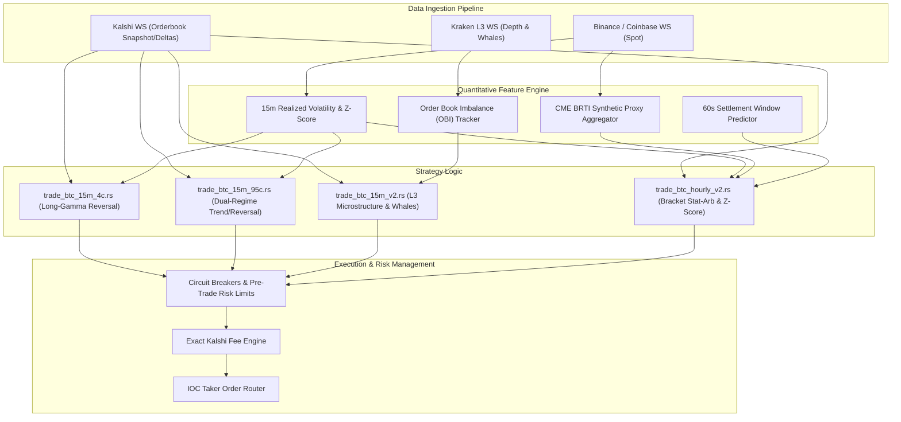

# High-Frequency Prediction Market Arbitrage & Market Making Engine
## Quantitative Research & Architectural Writeup

---

### Executive Summary

This project is a high-performance, ultra-low-latency quantitative trading system written in **Rust** designed to trade Bitcoin binary options and event contracts on **Kalshi** and **Polymarket**. 

Trading binary contracts expiring every 15 minutes (`KXBTC15M`) and hourly (`KXBTCD`) presents unique mathematical and microstructural challenges: extreme non-linear payoff functions (digital options delta/gamma explosions), tight expiry windows, non-linear exchange fee schedules, and severe orderbook spread dynamics.

To gain an edge in this market, the codebase evolves across four key execution binaries—moving from simple directional bets to multi-exchange latency arbitrage, order book imbalance (OBI) tracking on Kraken L3 feeds, Z-score drift models, and dynamic strike bracket arbitrage.

---

## 1. System Architecture & High-Frequency Pipeline

The engine is engineered for low latency, determinism, and async concurrency using Tokio, Tungstenite WebSockets, and thread-safe lock-free state primitives.



---

## 2. In-Depth Strategy & Research Breakdown

### Strategy 1: `trade_btc_15m_4c.rs` — Asymmetric Low-Cost Reversal Engine (High Gamma)

* **Core Research Focus**: Exploiting asymmetric payoffs in out-of-the-money (OTM) binary contracts during high-volatility regime shifts.
* **Market Mechanics**: Binary options settle at either $100\text{¢}$ (YES) or $0\text{¢}$ (NO). When an option is deep OTM, it trades at $3\text{¢} - 4\text{¢}$. If spot price experiences a sudden micro-reversal, the contract value surges toward $50\text{¢}-100\text{¢}$, providing up to a $25\times$ risk-to-reward ratio.
* **Quantitative Trigger**:
  1. **Expiry Window**: Active only in the final 7 minutes ($T \le 420\text{s}$).
  2. **Price Distance ($\Delta$)**: $\$50 \le |\text{Spot} - \text{Strike}| \le \$250$.
  3. **Volatility Filter**: 15-minute rolling realized volatility $\sigma_{15m} > \$150$.
  4. **Cost Ceiling**: Asymmetric entry priced strictly at $\le 4\text{¢}$ with tight bid-ask spread ($\text{Ask} - \text{Bid} \le 3\text{¢}$).
* **Execution & Risk Management**: Uses Immediate-or-Cancel (IOC) taker orders to eliminate queue latency. Features an automated **Panic Exit** module: if average position cost is high ($\ge 97\text{¢}$) and bid liquidity drops below $65\text{¢}$, the bot dumps position to cap tail risk.

---

### Strategy 2: `trade_btc_15m_95c.rs` — Bifurcated Dual-Regime Trading Engine

* **Core Research Focus**: Dynamic switching between Mean-Reverting Tail Risk (Long Gamma) and High-Probability Trend Continuation (Short Gamma).
* **Market Mechanics**: Binary option deltas exhibit extreme clustering near expiry. When spot is far from strike or volatility is suppressed, probability approaches binary saturation ($98\text{¢} - 99\text{¢}$). Conversely, when volatility is expanding near the strike boundary, mean-reversing trades dominate.
* **Bifurcated Model Formulations**:
  * **Regime A (High-Vol Reversal)**:
    $$|\Delta| \in [50, 250] \quad \text{AND} \quad \sigma_{15m} > 150 \implies \text{Buy Ask} \le 4\text{¢}$$
  * **Regime B (Trend Continuation / Saturation)**:
    $$|\Delta| > 250 \quad \text{OR} \quad \left(|\Delta| > 100 \ \text{AND} \ \sigma_{15m} < 50\right) \implies \text{Buy Ask} \ge 98\text{¢}$$
  * **Regime C (Late Theta-Decay Capture)**:
    $$T \le 240\text{s} \quad \text{AND} \quad |\Delta| > 115 \quad \text{AND} \quad \sigma_{15m} < 75 \implies \text{Buy Ask} \ge 98\text{¢}$$
* **Order Book Depth Sweeper**: Implements custom `fill_order()` logic that parses 100 limit price levels in the orderbook snapshot, evaluating real-time order fill matching and slippage against the exact Kalshi fee schedule.

---

### Strategy 3: `trade_btc_15m_v2.rs` — Microstructure Execution with Kraken L3 & Whale Analytics

* **Core Research Focus**: Order Book Imbalance (OBI), Level 3 market depth feeds, and institutional order flow detection as leading indicators for spot breakout direction.
* **Market Mechanics**: Spot ticker prices reflect executed trades (lagging). Limit order additions, cancellations, and large block sweeps (Whales) on Level 3 exchanges (Kraken) signal informed directional flow *before* spot price moves across strike thresholds.
* **Microstructure Innovations**:
  * **Order Book Imbalance (OBI)**: Calculated tick-by-tick across top levels:
    $$OBI = \frac{\sum Q_{bids} - \sum Q_{asks}}{\sum Q_{bids} + \sum Q_{asks}} \in [-1.0, 1.0]$$
  * **Whale Order Detection**: Real-time identification of institutional liquidity blocks ($> \$50,000$ volume fills/cancels) on Kraken L3 stream within a rolling 30-second window.
  * **Signal Confirmation Filter**: Prevents whipsaws and high-frequency noise by requiring directional price divergence to persist continuously for at least $4\text{ seconds}$ before generating an execution signal.

---

### Strategy 4: `trade_btc_hourly_v2.rs` — Hourly Multi-Strike Bracket Arbitrage & Z-Score Engine

* **Core Research Focus**: Statistical arbitrage and dynamic strike bracket migration on hourly BTC binary contracts (`KXBTCD`).
* **Market Mechanics**: Hourly contracts feature multiple strike brackets. By subscribing concurrently to bounding strikes $[K_{low}, K_{high}]$, the engine models joint probability distributions, volatility skew, and boundary departures.
* **Key Algorithmic Components**:
  1. **CME BRTI Synthetic Proxy**: Real-time weighted aggregation across Binance, Kraken, Coinbase, and OKX feeds to mirror CME Bitcoin Reference Rate calculation prior to index publication.
  2. **Rolling Z-Score Drift Model**:
     $$Z = \frac{\Delta_{spot} - \mu_{\Delta, 15m}}{\sigma_{\Delta, 15m}}$$
     Evaluates statistical significance of spot moves relative to strike boundaries to prevent false breakout entries.
  3. **Dynamic Bracket Migration**: Automatically monitors spot departures outside $[K_{low} - \text{buffer}, K_{high} + \text{buffer}]$. When spot breaks out of range, the stream seamlessly tears down WS connections and re-discovers active strike brackets without missing a tick.
  4. **60-Second Settlement Predictor**: Models Kalshi’s official 60-second settlement averaging formula:
     $$P_{required} = \frac{K_{strike} \cdot 60 - \sum_{i=1}^{t} P_i}{60 - t}$$
     Calculates the exact per-second spot price needed for the contract to settle ITM during the final minute.

---

## 3. Mathematical Foundations & Microstructure Models

### A. Non-Linear Kalshi Fee Math
Kalshi imposes a non-linear fee structure based on contract price $P$ (in dollars) and number of contracts $N$:
$$\text{Fee}(P, N) = \left\lceil 0.07 \times N \times P \times (1 - P) \right\rceil$$

Standard fixed-fee assumptions fail severely near $P = 0.50\text{¢}$, where fee drag peaks at $1.75\text{¢}$ per contract. The codebase integrates `kalshi_fee_exact()` into all pre-trade EV calculations:

```rust
pub fn kalshi_fee_exact(price_cents: u16) -> f64 {
    let p = price_cents as f64 / 100.0;
    let fee = 0.07 * p * (1.0 - p);
    (fee * 100.0).ceil() / 100.0
}
```

### B. Strategy Comparison Matrix

| Strategy File | Time Horizon | Volatility Target | Key Microstructure Feature | Risk / Reward Profile |
| :--- | :--- | :--- | :--- | :--- |
| **`trade_btc_15m_4c.rs`** | 15 Mins ($T \le 7\text{m}$) | High ($\sigma > 150$) | Orderbook Spread $\le 3\text{¢}$ | Asymmetric (Risk 4¢, Gain 96¢) |
| **`trade_btc_15m_95c.rs`** | 15 Mins ($T \le 7\text{m}$) | Dual (High / Low) | 100-Level Depth Parsing | High Probability / Low Margin |
| **`trade_btc_15m_v2.rs`** | 15 Mins ($T \le 15\text{m}$) | Any | Kraken L3 OBI & Whale Signals | Signal-Confirmed Flow Execution |
| **`trade_btc_hourly_v2.rs`** | 60 Mins ($T \le 60\text{m}$) | Dynamic | CME BRTI Proxy & Z-Score | Multi-Strike Bracket Stat-Arb |

---

## 4. Key Engineering Highlights & Best Practices

1. **Deterministic State Synchronization**: Uses atomic variables, `Arc<Mutex<SimpleBook>>`, and memory-allocated arrays (`[i64; 100]`) to process orderbook deltas without heap allocations during hot code paths.
2. **Pre-Trade Risk Management**: Strict risk limits enforced via `RiskState` & `RiskLimits`:
   * Max position sizing caps ($N \le 90$ contracts).
   * Cumulative loss circuit breakers ($< 300\text{¢}$).
   * Expiry blackout windows ($T \le 30\text{s}$ hard stop on execution).
3. **Multi-Exchange Resilience**: Automatic fallback between Binance, Kraken L2/L3, and CME index streams ensuring uptime during exchange outage events.

---

## 5. Next Steps & Recommended Project Enhancements

To showcase this research at an institutional or quant fund level, consider adding the following:

1. **Tick-to-Trade Latency Benchmarks**:
   * Add high-resolution `std::time::Instant` instrumentation from WebSocket frame read to REST IOC order dispatch, presenting a histogram of tick-to-trade latency ($\mu\text{s}$).
2. **Backtesting & Simulation Harness**:
   * Build a replay engine using historical Kalshi WebSocket delta files (`.jsonl.gz`) to evaluate Sharpe Ratio, Max Drawdown, and Win Rate across different volatility regimes.
3. **Execution Dashboard**:
   * Build a lightweight web frontend (Next.js / Vite + WebSocket) displaying live OBI, Z-scores, active strike brackets, and current PnL.
4. **Cross-Exchange Arbitrage (Kalshi vs. Polymarket)**:
   * Expand `trade_btc_15m_cross_arb.rs` to showcase simultaneous price discrepancy arbitrage between Kalshi (CFTC-regulated) and Polymarket (DeFi AMM/CLOB).
